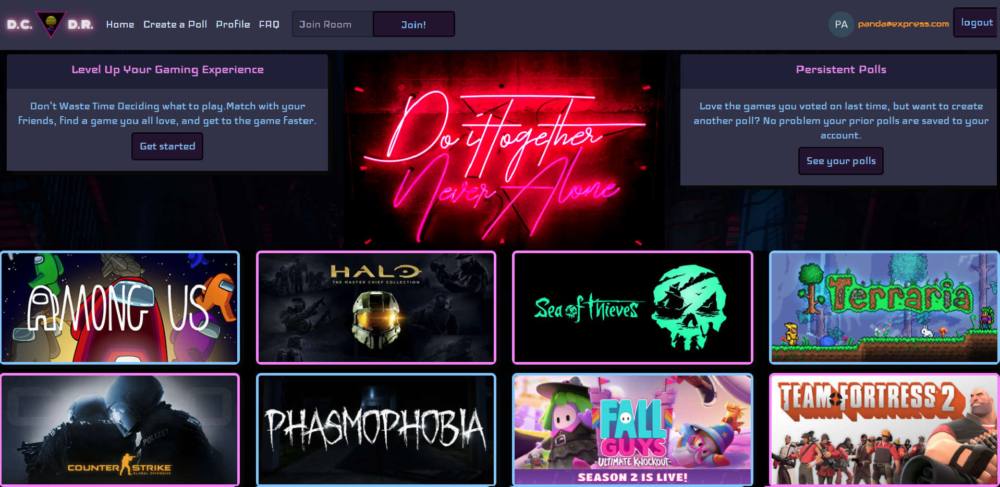
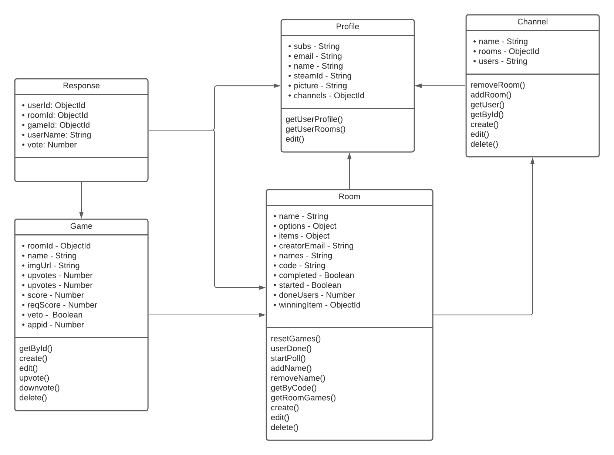

# Capstone Project DCDR

  

# About

This was a Capstone project I worked on with fellow Codeworks students Samuel Taylor, Lance Haney, and Corey Whitmore.  The idea behind this application was to create multi-user polls, referred to as rooms in the UML, to quickly decide on which PC game to play on a Friday evening.  Since most members of this group had steam accounts, we decided to include the steam API to help users add items to their polls, as well as allow for custom items to be added to any poll.  This is a Full-Stack Application written using the Vue.js framework on the front end and node.js, express, and mongoDB on the back end. 

# Key Features

 - Mobile-First/Friendly Design
 - High Contrast Colors for Accessibility
 - Steam API connectivity
 - User Authentication and Login with Auth 0
 - Polls can be joined by anyone regardless of login status
 - Created polls saved to user profiles for later use 
 - Sockets for real-time poll updates
 - Randomized voting lists for each user

# FAQ

1. Do I need to be logged in to create or join a poll?
         
  - You do not need to log in to join a poll.  However, you must be logged in to create one.
            
2. I joined a room without logging in.  Why can't I add items to the poll?
            
  - The host has the ability to limit who can add items to the poll.  Ask them to change it next time.
           
3. Can I use this to help my friends decide what to do other than play computer games?

  - Sure!  You can add non-game items as well as anything else to a poll.  The only thing that is required is a name for the poll item.

4. Why isn't my steam library loading?

  - If you cloned this repository make sure to create a STEAM_KEY variable in your .env file. If you are accessing the heroku page make sure you set your steam user profile to public in order for the api to work properly.  If your profile is public and you are still having trouble, double check your steam profile id number associated with your account page link.  Some non-numerical links may not work.

5. What does DCDR stand for?

  - Decider, Discerning Doctor, Disconnect Doctor etc.

6. Why the neon theme?

  - We were going for a neo 80s synthwave vibe that's somewhat popular in certain gaming circles. Glowy leds for everyone!

7. Where can I go to report a bug in the website?

  - No bug report feature exists at this time.

# UML Diagram

  

